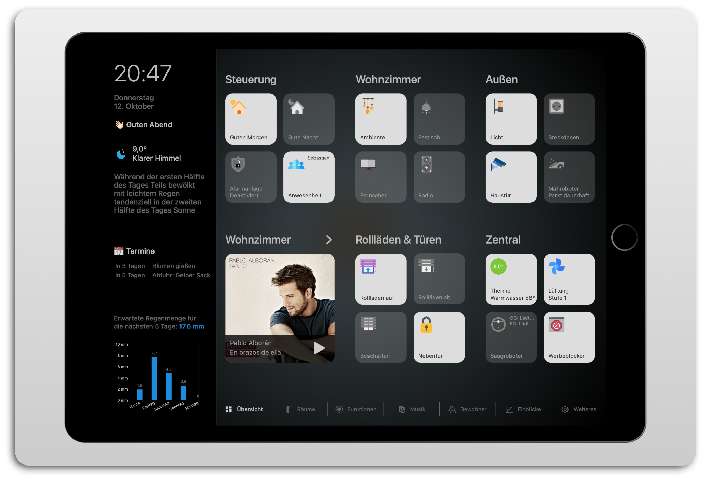

# ioBroker.vis-homekittiles



[](https://www.npmjs.com/package/iobroker.vis-homekittiles)
[](https://www.npmjs.com/package/iobroker.vis-homekittiles)


[](https://nodei.co/npm/iobroker.vis-homekittiles/)

**Tests:** 

## 🇩🇪 HomeKit-Tiles für ioBroker-VIS

Homekit-Tiles ist ein Widget-Set, das an das Design von Apple HomeKit angelehnt ist.
Die Besonderheit der Widgets liegt darin, dass sie keine festen Style-Elemente enthalten, sondern alles per CSS formatiert wird. Demzufolge gibt es im VIS-Editor auch keine gesonderten Einstellungen für Position und/oder Größe der Icons, Beschriftungen, usw. Anpassungen des Designs erfolgen durch Ändern des CSS-Codes. Hierzu kann der CSS-Code aus der Datei `/widgets/homekittiles/css/style.css` als Vorlage genutzt werden. Der Code wird im VIS-Editor im CSS-Tab eingefügt und kann nach Belieben angepasst werden. Das Hinzufügen von eigenen CSS-Klassen über den VIS-Editor im Abschnitt "Generell" der Widgets ist ebenfalls möglich.

Die Widgets sind für VIS 1.x konzipiert.

**Hinweis:** Aus lizenzrechtlichen Gründen sind im Lieferumfang dieses Adapters keine Icons enthalten. Sehr gute Quellen für Icons sind:

* [https://www.flaticon.com](https://www.flaticon.com)
* [https://icons8.com](https://icons8.com)

## Widget-Typen

### hkt-Notification


Notification kann zur Anzeige von Benachrichtigungen (ähnlich den roten Bubbles von Handy-Apps) genutzt und an beliebigen Stellen positioniert werden. Es eignet sich ideal für die Verwendung in Kombination mit einem Navigationsbutton um anzuzeigen, dass es auf der entsprechenden View Störungen/Fehler/Wichtige Informationen gibt. Unterstützt werden 5 Datenpunkte und damit einhergehend 5 verschiedene Farben für die Benachrichtigungen. Über Checkboxen kann ausgewählt werden, ob die Benachrichtigungen auch bei dem Wert `0` angezeigt werden sollen.

### hkt-Datepicker


Mit dem Datepicker kann ein Datum aus dem Kalender ausgewählt werden, das Widget verwendet dafür den jqui-Datepicker. Da dieser sehr komplex ist und nicht kopiert/nachgebildet werden sollte, und um andere VIS-Projekte auf demselben System nicht zu stören, enthält das Widget keine integrierten Formatierungen für das Datepicker-Fenster. Um das Aussehen dennoch anzupassen, kann folgender CSS-Code im VIS-Projekt eingefügt werden:

```CSS
.ui-datepicker {
    padding: 0;
    font-size: 15px;
    border-radius: 5px;
    font-family: -apple-system;
    border: unset;
    background: unset;
    color: unset;
    background-color: #888;
}
.ui-datepicker .ui-datepicker-header {
    padding: .2em 0;
    border-radius: 5px 5px 0 0;
    color: unset;
    border: unset;
    background: unset;
    background-color: var(--hkt-color-tile-on-background);
    font-weight: bold;
}
.ui-datepicker .ui-datepicker-header .ui-datepicker-prev-hover,
.ui-datepicker .ui-datepicker-header .ui-datepicker-next-hover {
    border: unset;
    background: unset;
    font-weight: unset;
    color: unset;
    top: 2px;
}
.ui-datepicker .ui-datepicker-header .ui-datepicker-prev .ui-icon-circle-triangle-w,
.ui-datepicker .ui-datepicker-header .ui-datepicker-next .ui-icon-circle-triangle-e {
    background-image: unset;
}
.ui-datepicker .ui-datepicker-header .ui-datepicker-prev .ui-icon-circle-triangle-w:before {
    content: "";
    position: relative;
    width: 20px;
    height: 20px;
    display: block;
    color: #000;
    border-width: 3px 0 0 3px;
    border-color: #000;
    border-style: solid;
    transform: rotate(-45deg);
    top: -3px;
    left: 5px;
}
.ui-datepicker .ui-datepicker-header .ui-datepicker-next .ui-icon-circle-triangle-e:before {
    content: "";
    position: relative;
    width: 20px;
    height: 20px;
    display: block;
    color: #000;
    border-width: 3px 3px 0 0;
    border-color: #000;
    border-style: solid;
    transform: rotate(45deg);
    top: -3px;
    left: -12px;
}
.ui-datepicker .ui-state-default {
    border: unset;
    background: unset;
    font-weight: unset;
    color: unset;
}
.ui-datepicker .ui-datepicker-current-day {
    color: var(--hkt-color-tile-on-foreground);
    background-color: var(--hkt-color-tile-on-background);
    font-weight: bold;
}
.ui-datepicker .ui-datepicker-today {
    color: orange;
}
```

### hkt-Radiobuttons


Radiobuttons dienen vornehmlich zur Umschaltung vordefinierter Werte für einen State. Die Ausrichtung der Schaltflächen (nebeneinander oder untereinander) geschieht nicht automatisch, sondern muss per Checkbox vorgegeben werden. Die Anzahl der Schaltflächen kann nach Bedarf eingestellt und die Werte, die jeweils in den State geschrieben werden sollen, können frei gewählt werden. Zusätzlich ist es möglich, jede Schaltfläche mit einer Beschriftung und/oder einem Icon auszustatten. Weitere Funktionen:

* **Bestätigte Änderung:** zeigt ein Icon, wenn das Ack-Flag des States nicht gesetzt ist (=unbestätigte Änderung). Über eine Checkbox kann die Logik umgekehrt werden, sodass das Icon dann erscheint, wenn das Ack-Flag gesetzt ist (=bestätigte Änderung). Mit einer weiteren Checkbox kann das Icon dauerhaft rotieren (CSS-Klasse `spin` wird hinzugefügt). Das Ack-Icon wird im Quellcode an jeder Schaltfläche hinzugefügt, mit dem mitgelieferten Quellcode jedoch nur an der aktiven Schaltfläche angezeigt.

### hkt-Switch-Bool


Das Switch-Bool-Widget dient als einfacher An/Aus-Schalter für States vom Typ `boolean` und zeigt ein Icon. Es besitzt zwei Beschriftungsgruppen und eine Bediensperre, die mit dem mitgelieferten CSS-Code wie folgt funktionieren:

* **Beschriftungsgruppe 1:** wird im unteren Bereich des Widgets angezeigt. "Beschriftung" (Zeile 1) ist ein fester Text. Eine zweite Zeile kann über "Beschriftung 2" definiert und aus mehreren Elementen zusammengesetzt werden (ein einführender statischer Text, Wert eines Datenpunktes, Einheit des Wertes (wird ohne Leerzeichen an den Wert angehängt), zusätzlicher Text am Ende).
* **Beschriftungsgruppe 2:** wird oben-rechts im Widget angezeigt und kann bis zu 3 zusätzliche Informationen darstellen, die auf dieselbe Weise wie "Beschriftung 2" konfiguriert werden. Je nach Widget-Größe ist der Platz dabei begrenzt, jedoch durchaus ausreichend, um technische Informationen darzustellen (z.B. `U: 230V, P: 12W`).
* **Wert inkrementieren:** wird oben-rechts im Widget angezeigt und blendet zwei zusätzliche Schaltflächen mit der Beschriftung (+) und (-) ein. Durch Betätigung dieser Schaltflächen kann der Wert eines beliebigen States erhöht oder verringert werden. Dies eignet sich ideal, um Beispielsweise einen in der Beschriftungsgruppe 1 eingeblendeten Sollwert zu verändern.
* **Bedienung sperren:** Diese Einstellung ermöglicht es, die Bedienung des Widgets zu unterbinden, wenn der Wert des States `true` oder `false` ist, sodass beispielsweise ein Gerät mit diesem Widget nur ausgeschaltet, jedoch nicht eingeschaltet werden kann (oder andersherum). Durch aktivieren beider Checkboxen kann die Bedienung komplett unterbunden werden und das Widget dient nur noch als Zustandsanzeige. Optional kann ein zusätzliches Icon eingeblendet werden, wenn die Bedienung gesperrt ist. "Bedienung sperren" wirkt ebenfalls auf "Wert inkrementieren".
* **Bestätigte Änderung:** zeigt ein Icon, wenn das Ack-Flag des States nicht gesetzt ist (=unbestätigte Änderung). Über eine Checkbox kann die Logik umgekehrt werden, sodass das Icon dann erscheint, wenn das Ack-Flag gesetzt ist (=bestätigte Änderung). Mit einer weiteren Checkbox kann das Icon dauerhaft rotieren (CSS-Klasse `spin` wird hinzugefügt).

**Hinweis:** im mitgelieferten CSS-Code ist es nicht vorgesehen, dass "Beschriftungsgruppe 2", "Wert inkrementieren", "Bedienung sperren" und "Bestätigte Änderung" gleichzeitig verwendet werden. Durch Verbreiterung des Widgets und/oder Anpassung des Codes ist dies jedoch möglich.

### hkt-Value


Das Value-Widget dient zur Anzeige von Werten, vornehmlich Zahlenwerten. Es besitzt zwei Beschriftungsgruppen und (+)/(-)-Tasten, die mit dem mitgelieferten CSS-Code wie folgt funktionieren:

* **Beschriftungsgruppe 1:** wird im unteren Bereich des Widgets angezeigt. "Beschriftung" (Zeile 1) ist ein fester Text. Eine zweite Zeile kann über "Beschriftung 2" definiert und aus mehreren Elementen zusammengesetzt werden (ein einführender statischer Text, Wert eines Datenpunktes, Einheit des Wertes (wird ohne Leerzeichen an den Wert angehängt), zusätzlicher Text am Ende).
* **Beschriftungsgruppe 2:** wird oben-rechts im Widget angezeigt und kann bis zu 3 zusätzliche Informationen darstellen, die auf dieselbe Weise wie "Beschriftung 2" konfiguriert werden. Je nach Widget-Größe ist der Platz dabei begrenzt, jedoch durchaus ausreichend, um technische Informationen darzustellen (z.B. `H: 64%, Y: 10%`).
* **Wert inkrementieren:** wird oben-rechts im Widget angezeigt und blendet zwei zusätzliche Schaltflächen mit der Beschriftung (+) und (-) ein. Durch Betätigung dieser Schaltflächen kann der Wert eines beliebigen States erhöht oder verringert werden. Dies eignet sich ideal, um Beispielsweise einen in der Beschriftungsgruppe 1 eingeblendeten Sollwert zu verändern.

**Hinweis:** im mitgelieferten CSS-Code ist es nicht vorgesehen, dass "Beschriftungsgruppe 2" und "Wert inkrementieren" gleichzeitig verwendet werden. Durch Verbreiterung des Widgets oder Anpassung des Codes ist dies jedoch möglich.

### hkt-ViewInWidget-Dialog


Das Widget öffnet ein Dialogfenster, das eine andere View anzeigt. Das Dialog-Fenster besitztz keinen eigenen Schließen-Button. Dieser muss in der angezeigten View eingefügt werden. Beim Öffnen und Schließen kann ein beliebiger State gesetzt werden, die geschriebenen Werte sind dabei frei auswählbar. Zu beachten gilt hierbei jedoch, dass der Wert beim Schließen nur dann gesetzt wird, wenn das Dialogfenster über einen Dialog-Close-Button geschlossen wurde, nicht jedoch beim Neuladen der gesamten VIS.

Der mitgelieferte CSS-Code funktioniert wie folgt:

* **Beschriftungsgruppe 1:** wird im unteren Bereich des Widgets angezeigt. "Beschriftung" (Zeile 1) ist ein fester Text. Eine zweite Zeile kann über "Beschriftung 2" definiert und aus mehreren Elementen zusammengesetzt werden (ein einführender statischer Text, Wert eines Datenpunktes, Einheit des Wertes (wird ohne Leerzeichen an den Wert angehängt), zusätzlicher Text am Ende).
* **Beschriftungsgruppe 2:** wird oben-rechts im Widget angezeigt und kann bis zu 3 zusätzliche Informationen darstellen, die auf dieselbe Weise wie "Beschriftung 2" konfiguriert werden. Je nach Widget-Größe ist der Platz dabei begrenzt, jedoch durchaus ausreichend, um technische Informationen darzustellen (z.B. `H: 64%, Y: 10%`).
* **Dialog:** definiert die Eigenschaften des Dialogfensters. Die Eigenschaften "Dialoghöhe" und "Dialogbreite" beziehen sich auf den Inhalt der angezeigten View. Die Titelzeile wird zur Gesamthöhe hinzugefügt. Mit der Eigenschaft "Pfeil am Dialog anzeigen" kann dem Dialogfenster am Rand ein Pfeil hinzugefügt werden, sodass der Eindruch einer Sprechblase entsteht.

### hkt-Settings-Bool


Das Settings-Bool-Widget dient als einfacher An/Aus-Schalter für States vom Typ `boolean` und für die Verwendung auf Seiten gedacht, wo mehrere Einstellungsoptionen dargestellt werden. Es besitzt eine Bediensperre, die mit dem mitgelieferten CSS-Code wie folgt funktionieren:

* **Bedienung sperren:** Diese Einstellung ermöglicht es, die Bedienung des Widgets zu unterbinden, wenn der Wert des States `true` oder `false` ist, sodass beispielsweise ein Gerät mit diesem Widget nur ausgeschaltet, jedoch nicht eingeschaltet werden kann (oder andersherum). Durch aktivieren beider Checkboxen kann die Bedienung komplett unterbunden werden und das Widget dient nur noch als Zustandsanzeige. Optional kann ein zusätzliches Icon eingeblendet werden, wenn die Bedienung gesperrt ist.

### hkt-Settings-Value


Das Settings-Value-Widget dient zur Anzeige von Werten, vornehmlich Zahlenwerten. Es besitzt (+)/(-)-Tasten, die mit dem mitgelieferten CSS-Code wie folgt funktionieren:

* **Wert inkrementieren:** neben dem eigentlichen Anzeigewert werden zwei zusätzliche Schaltflächen mit der Beschriftung (+) und (-) angezeigt. Durch Betätigung dieser Schaltflächen kann der Wert erhöht oder verringert werden. * **Bedienung sperren:** Diese Einstellung ermöglicht es, die Bedienung des Widgets zu unterbinden, wenn der Wert des States `true` oder `false` ist, sodass beispielsweise ein Gerät mit diesem Widget nur ausgeschaltet, jedoch nicht eingeschaltet werden kann (oder andersherum). Durch aktivieren beider Checkboxen kann die Bedienung komplett unterbunden werden und das Widget dient nur noch als Zustandsanzeige. Optional kann ein zusätzliches Icon eingeblendet werden, wenn die Bedienung gesperrt ist.

### hkt-Button-DialogClose


Dieser Button schließt ein geöffnetes Dialogfenster. Wenn der Button außerhalb des Fensters platziert wird, muss die Widget-ID des Dialogfensters angegeben werden.

### hkt-Button-Set


Dieses Widget erzeugt eine einstellbare Anzahl an Buttons, wobei jeder Button einen eigenen State steuern kann. Welcher Wert dabei geschrieben wird kann je Button eingestellt werden. Durch Aktivieren der Checkbox "Dialog schließen" wird beim Betätigen des Buttons das Dialogfenster, in dem es platziert ist, geschlossen.
Das Widget kann auch außerhalb des eines Dialogfensters platziert werden, dann hat "Dialog schließen" jedoch keine Funktion.

### hkt-Button-Navigation


Der Button ruft die eingestellte View auf.

### hkt-Button-Set-Navigation


Das Widget erzeugt eine einstellbare Anzahl an Buttons für die Navigation zwischen verschiedenen Views. Mit dem mitgelieferten CSS-Code kann die Anordnung der Buttons per Checkbox zwischen horizontal und vertikal umgeschaltet werden. Bei horizontaler Anordnung ist die Breite jedes Buttons mit 120px festgelegt, bei vertikaler Anordnung ist die Höhe jedes Buttons mit 30px festgelegt.

### hkt-ViewInWidget-Swipe

Das Widget ist ein Container für Unterviews, die durch Scrollen gewechselt werden. Mit dem mitgelieferten CSS-Code muss nur ein Teil einer Unterview in den sichtbaren Bereich bewegt werden, die Scroll-Snap-Funktion übernimmt den Rest.
